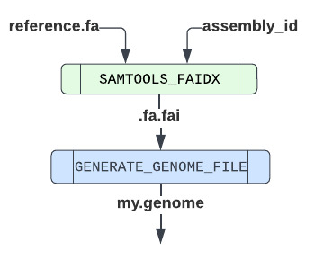
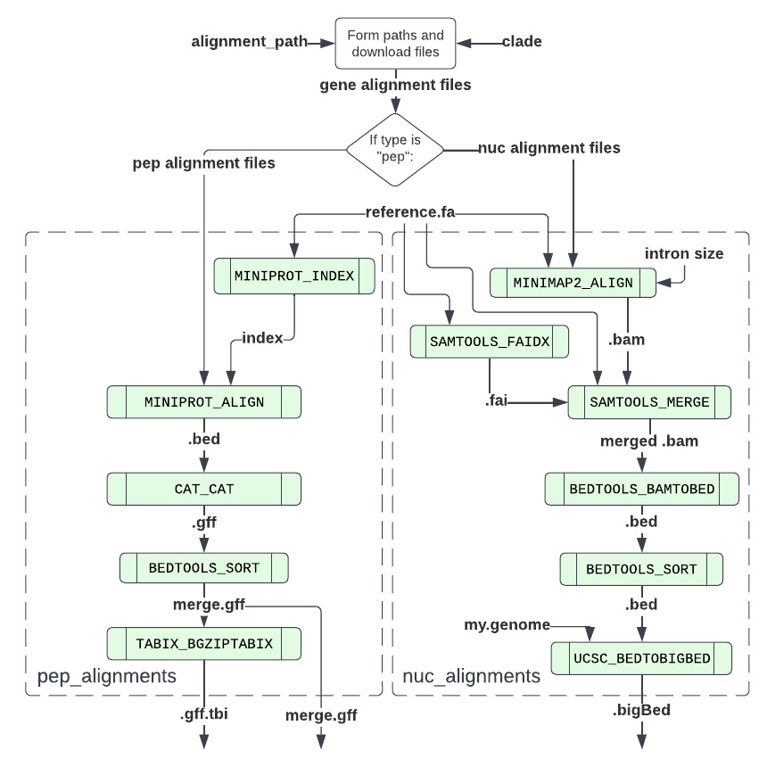
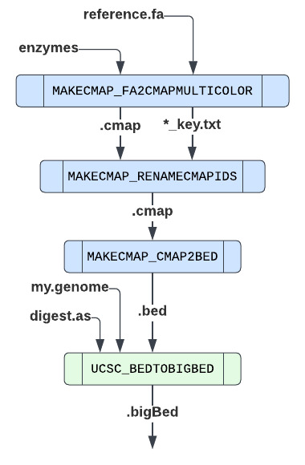
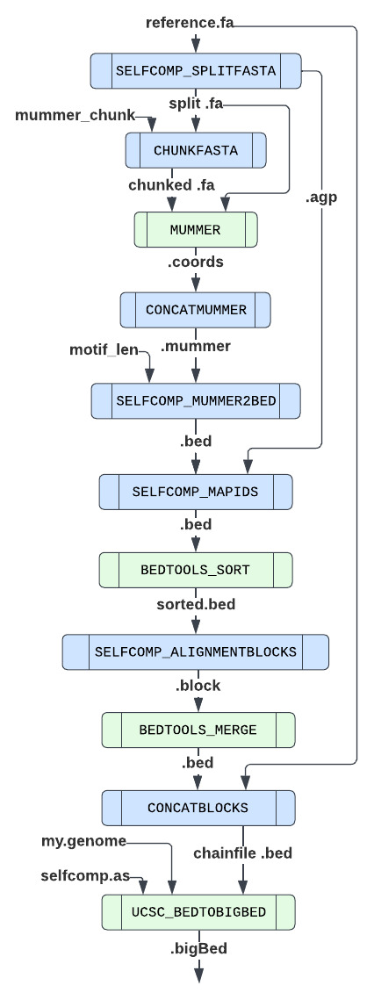
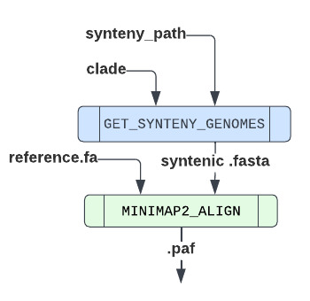

# nf-core/treeval: Output

## Introduction

This document describes the output produced by the pipeline.

The directories listed below will be created in the results directory after the pipeline has finished. All paths are relative to the top-level results directory.

## Pipeline overview

The pipeline is built using [Nextflow](https://www.nextflow.io/) and processes data using the following workflows:

- [INPUT_READ](#inputread) - Reads the input yaml for parameters used by other workflows.
- [GENERATE_GENOME](#generategenome) - Builds genome description file of the reference genome.
- [LONGREAD_COVERAGE](#longreadcoverage) - .
- [GAP_FINDER](#gapfinder) - .
- [REPEAT_DENSITY](#repeatdensity) - .
- [HIC_MAPPING](#hicmapping) - .
- [TELO_FINDER](#telofinder) - .
- [GENE_ALIGNMENT](#genealignment) - Aligns the peptide and nuclear data from assemblies of related species to the input genome.
- [INSILICO_DIGEST](#insilicodigest) - Generates a map of enzymatic digests using 3 Bionano enzymes.
- [SELFCOMP](#selfcomp) - Identifies regions of self-complementary sequence.
- [SYNTENY](#synteny) - Generates syntenic alignments between other high quality genomes.
- [BUSCO_ANALYSIS](#buscoanalysis) - Uses BUSCO to identify ancestral elements. Also use to identify ancestral Lepidopteran genes (merian units).

- [Pipeline information](#pipeline-information) - Report metrics generated during the workflow execution

### INPUT_READ

This subworkflow reads the input .yaml and outputs the parameters used by each of the other subworkflows.

### GENERATE_GENOME

Output files

- `treeval_upload/`
  - `my.genome`: Genome description file of the reference genome.

This workflow generates a .genome file which describes the base pair length of each scaffold in the reference genome. This is performed by [SAMTOOLS_FAIDX](https://nf-co.re/modules/samtools_faidx) to generate a .fai file. This index file is trimmed using local module [GENERATE_GENOME_FILE](../modules/local/generate_genome_file.nf) to output a .genome file. This file is then recycled into the workflow to be used by a number of other subworkflows.

TODO: UPDATE FILE

### LONGREAD_COVERAGE

To be added.

### GAP_FINDER

To be added.

### REPEAT_DENSITY

To be added.

### HIC_MAPPING

To be added.

### TELO_FINDER

To be added.

### BUSCO_ANALYSIS

To be added.

### GENERATE_ALIGNMENT

Output files

- `treeval_upload/`
  - `*.gff.gz`: Zipped .gff for each species with peptide data.
  - `*.gff.gz.tbi`: TBI index file of each zipped .gff.
  - `*_cdna.bigBed`: BigBed file for each species with complementary DNA data.
  - `*_cds.bigBed`: BigBed file for each species with nuclear DNA data.
  - `*_rna.bigBed`: BigBed file for each species with nRNAdata.
- `treeval_upload/punchlists/`
  - `*_pep_punchlist.bed`: Punchlist for peptide track.
  - `*_cdna_punchlist.bed`: Punchlist for cdna track.
  - `*_cds_punchlist.bed`: Punchlist for cds track.
  - `*_rna_punchlist.bed`: Punchlist for rna track.

The gene alignment subworkflows loads genesets (cdna, cds, rna, pep) data from a given list of genomes detailed, in the input .yaml, and aligns these to the reference genome. It contains two subworkflows, one of which handles peptide data and the other of which handles RNA, nuclear and complementary DNA data. These produce files that can be displayed by JBrowse as tracks.

NUC_ALIGNMENTS: Reference fasta and fai files are aligned with the above mentioned gene alignment query files by [MINIMAP2_ALIGN](https://nf-co.re/modules/minimap2_align).
These are merged with [SAMTOOLS_MERGE](https://nf-co.re/modules/samtools_merge), converted to .bed format through [BEDTOOLS_BAMTOBED](https://nf-co.re/modules/bedtools_bamtobed), sorted via [BEDTOOLS_SORT](https://nf-co.re/modules/bedtools_sort) and finally converted to .bigBed format [UCSC_BEDTOBIGBED](https://nf-co.re/modules/ucsc_bedtobigbed) with the use of an auto SQL file found in the /assets/gene_alignment folder. This process is performed per species per data type.

PEP_ALIGNMENTS: Reference fasta is indexed with [MINIPROT_INDEX](https://nf-co.re/modules/miniprot_index) and aligned with peptide data [MINIPROT_ALIGN](https://nf-co.re/modules/miniprot_align). The output .gff file is merged with [CAT_CAT](https://nf-co.re/modules/cat_cat) per species, sorted with [BEDTOOLS_SORT](https://nf-co.re/modules/bedtools_sort) and indexed with [TABIX_BGZIPTABIX](https://nf-co.re/modules/tabix_bgziptabix/tabix_bgziptabix).

PUNCHLIST: Punchlists contain information on genes found to be duplicated (fully and partially) in the input genome. This is generated differently dependent on whether the datatype is peptide or not.
  - NUC_ALIGNMENT:PUNCHLIST takes the merged.bam produced after the [SAMTOOLS_MERGE](https://nf-co.re/modules/samtools_merge) step. This is then converted into a .paf file with [PAFTOOLS_SAM2PAF](https://github.com/nf-core/modules/tree/master/modules/nf-core/paftools/sam2paf) and finally into bed with [PAF2BED](../modules/local/paf_to_bed.nf).
  - PEP_ALIGNMENT:PUNCHLIST takes the merged.gff produced by [CAT_CAT](https://nf-co.re/modules/cat_cat) and converts it into .bed with [GFF_TO_BED](../modules/local/gff_to_bed.nf)

TODO: UPDATE DIAGRAM

### INSILICO_DIGEST

Output files

- `insilico/`
  - `*.bigBed`: Bionano insilico digest cut sites track in the bigBed format for each of the set digestion enzymes.

This process runs for each of the digestion enzymes (bspq1, bsss1, DLE1). Using local module MAKECMAP_FA2CMAPMULTICOLOR to convert reference genome fasta into a colour-aware bionano .cmap format and emits files containing the index IDs and original genomic locations, which are passed into local module MAKECMAP_RENAMECMAPIDS to rename the .cmap IDs. This is used to create the .bed file (via MAKECMAP_CMAP2BED) and subsequently the .bigBed file (by [UCSC_BEDTOBIGBED](https://nf-co.re/modules/ucsc_bedtobigbed)) to be displayed as a JBrowse track.

### SELFCOMP

Output files

- `selfcomp/`
  - `*.bigBed`: BigBed file containing selfcomp track data.

The reference fasta is split (SELFCOMP_SPLITFASTA) and chunked (CHUNKFASTA) to be by rapidly aligned with itself using [MUMMER](https://nf-co.re/modules/mummer). The outputted alignment files are merged (CONCATMUMMER) and converted into the .bed format (SELFCOMP_MUMMER2BED). This is then used by SELFCOMP_MAPIDS to generate a .bed file with a list of IDs and the genomic positions of selfcomplementary regions, which is then sorted by [BEDTOOLS_SORT](https://nf-co.re/modules/bedtools_sort). SELFCOMP_ALIGNMENTBLOCKS runs on this output to build alignment blocks. Merge alignment blocks ([BEDTOOLS_MERGE](https://nf-co.re/modules/bedtools_merge)) and then all individual block files (CONCATBLOCKS), filtered by motif length. This is converted to .bigBed by [UCSC_BEDTOBIGBED](https://nf-co.re/modules/ucsc_bedtobigbed).

### SYNTENY

Output files

- `synteny/`
  - `*.paf`: PAF file for each syntenic genomic aligned to reference.

This worflows searches along predetermined path for syntenic genome files based on clade and then aligns with [MINIMAP2_ALIGN](https://nf-co.re/modules/minimap2_align) each to the reference genome, emitting an aligned .paf file for each.

### BUSCO_ANALYSIS

To be added.

### Pipeline information

Output files

- `pipeline_info/`
  - Reports generated by Nextflow: `execution_report.html`, `execution_timeline.html`, `execution_trace.txt` and `pipeline_dag.dot`/`pipeline_dag.svg`.
  - Reports generated by the pipeline: `pipeline_report.html`, `pipeline_report.txt` and `software_versions.yml`. The `pipeline_report*` files will only be present if the `--email` / `--email_on_fail` parameter's are used when running the pipeline.
  - Reformatted samplesheet files used as input to the pipeline: `samplesheet.valid.csv`.

[Nextflow](https://www.nextflow.io/docs/latest/tracing.html) provides excellent functionality for generating various reports relevant to the running and execution of the pipeline. This will allow you to troubleshoot errors with the running of the pipeline, and also provide you with other information such as launch commands, run times and resource usage.