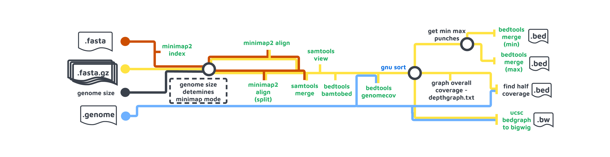
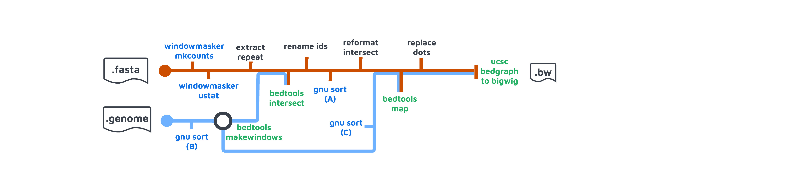
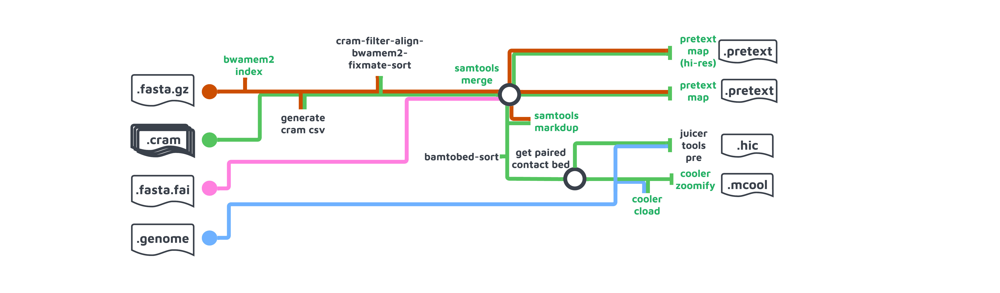
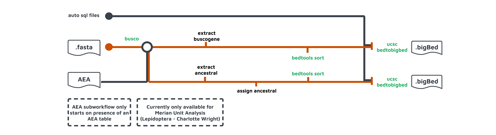
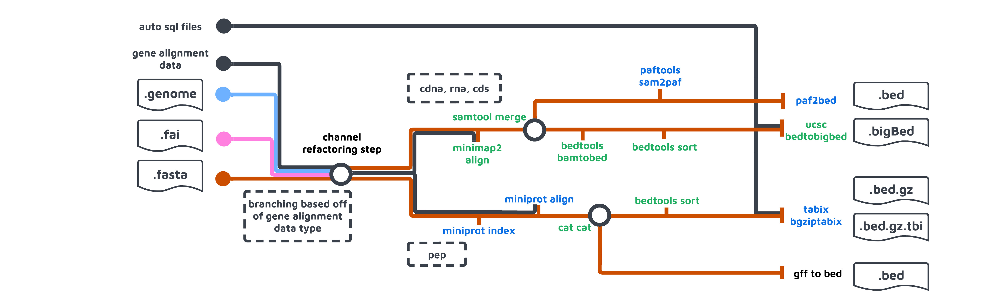
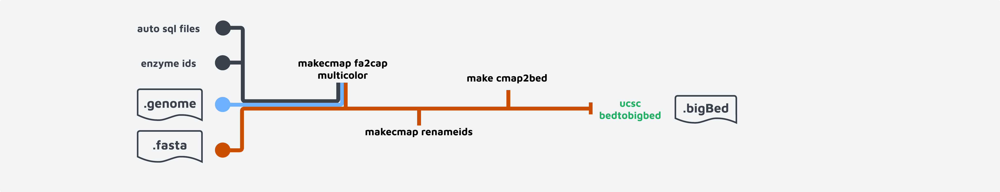

# nf-core/treeval: Output

## Introduction

This document describes the output produced by the pipeline.

The directories listed below will be created in the results directory after the pipeline has finished. All paths are relative to the top-level results directory.

## Pipeline overview

The pipeline is built using [Nextflow](https://www.nextflow.io/) and processes data using the following workflows:

- [YAML_INPUT](#yamlinput) - Reads the input yaml and generates parameters used by other workflows.
- [GENERATE_GENOME](#generategenome) - Builds genome description file of the reference genome.
- [LONGREAD_COVERAGE](#longreadcoverage) - Produces read coverage based on pacbio long read fasta file.
- [GAP_FINDER](#gapfinder) - Identifies contig gaps in the input genome.
- [REPEAT_DENSITY](#repeatdensity) - Reports the intensity of regional repeats within an input assembly.
- [HIC_MAPPING](#hicmapping) - Aligns illumina HiC short reads to the input genome, generates mapping file in three format for visualisation: .pretext, .hic and .mcool
- [TELO_FINDER](#telofinder) - .
- [GENE_ALIGNMENT](#genealignment) - Aligns the peptide and nuclear data from assemblies of related species to the input genome.
- [INSILICO_DIGEST](#insilicodigest) - Generates a map of enzymatic digests using 3 Bionano enzymes.
- [SELFCOMP](#selfcomp) - Identifies regions of self-complementary sequence.
- [SYNTENY](#synteny) - Generates syntenic alignments between other high quality genomes.
- [BUSCO_ANALYSIS](#buscoanalysis) - Uses BUSCO to identify ancestral elements. Also use to identify ancestral Lepidopteran genes (merian units).

- [Pipeline information](#pipeline-information) - Report metrics generated during the workflow execution

### YAML_INPUT

This subworkflow reads the input .yaml via the use of the built-in snakeyaml.Yaml component, which converts the yaml into a nested list. Via some simple channel manipulation, each item in this nexted list is converted into a parameter for use in each of the other subworkflows.

### GENERATE_GENOME

Output files

- `treeval_upload/`
  - `my.genome`: Genome description file of the reference genome.

This workflow generates a .genome file which describes the base pair length of each scaffold in the reference genome. This is performed by [SAMTOOLS_FAIDX](https://nf-co.re/modules/samtools_faidx) to generate a .fai file. This index file is trimmed using local module [GENERATE_GENOME_FILE](../modules/local/generate_genome_file.nf) to output a .genome file. This file is then recycled into the workflow to be used by a number of other subworkflows.

### LONGREAD_COVERAGE

Output files

- `treeval_upload/`
  - `coverage.bw`: Coverage of aligned reads across the reference genome in bigwig format.
- `treeval_upload/punchlists/`
  - `maxdepth.bigbed`: Max read depth punchlist in bigBed format.
  - `zerodepth.bigbed`: Zero read depth punchlist in bigBed format.
  - `halfcoverage.bigbed`: Half read depth punchlist in bigBed format.

[MINIMAP2_INDEX](https://nf-co.re/modules/minimap2_index): Indexing the input genome.

[MINIMAP2_ALIGN](https://nf-co.re/modules/minimap2_align): Taking genome size into consideration, the alignment methods are defined. The 'split_prefix' option helps improve the alignment performance of Minimap by organizing and identifying individual segments of the reference genome during indexing. It allows for better management and subsequent alignment of long reads against the segmented reference genome. The input of MINIMAP2_ALIGN are input fasta index and a set of long read sequence fasta file, the process produces a set of mapped .bam file.

[SAMTOOLS_MERGE](https://nf-co.re/modules/samtools_merge):  Merges multiple .bam files from the MINIMAP2_ALIGN step into a single, consolidated .bam file. 

[SAMTOOLS_VIEW](https://nf-co.re/modules/samtools_view): Mainly using the "-hF 256" filtering option in samtools view to eliminate the secondary alignments from the merged .bam file. The .bam file which contains only primary alignment then is convert to .bed file by using [BEDTOOLS_BAMTOBED](https://nf-co.re/modules/bedtools_bamtobed).

[BEDTOOLS_GENOMECOV](https://nf-co.re/modules/bedtools_genomecov): Calculate the coverage of aligned reads across the reference genome by taking the .bed file that only contains primary alignments and a genome size file as input, output a bedGraph file, the .bedGraph file is then converted into .bigwig format using [UCSC_BEDGRAPHTOBIGWIG](https://nf-co.re/modules/ucsc_bedgraphtobigwig).

Finally zero read depth, maximum read depth and half read depth lists are generated by [GETMINMAXPUNCHES](../modules/local/getminmaxpunches.nf) and [FINDHALFCOVERAGE](../modules/local/findhalfcoverage.nf) respectively.

### GAP_FINDER

Output files

- `treeval_upload/`
  - `*.bed.gz`: A bgzipped file containing gap locations
  - `*.bed.gz.tbi`: A tabix index file for the above file.
- `hic_files/`
  - `*.bed`: The raw bed file needed for ingestion into Pretext

The GAP_FINDER subworkflow generates a bed file containing the genomic locations of the gaps in the sequence. This is performed by the use of [SEQTK_CUTN]() which cuts the input genome at sites of N (gaps). [GAP_LENGTH]() then calculates the lengths of gaps generates in the previous step, this file is injected into the hic_maps at a later stage. SEQTK's output bed file is then BGzipped and indexed by [TABIX_BGZIPTABIX](https://nf-co.re/modules/tabix_bgziptabix).

### REPEAT_DENSITY

Output files

- `hic_files/`
  - `*_repeat_density.bw`: Intersected read windows aligned to the reference genome in bigwig format.

This uses [WindowMasker](https://github.com/goeckslab/WindowMasker) to mark potential repeats on the genome. The genome is chunked into 10kb bins which move along the entire genome as sliding windows in order to profile the repeat intensity. Bedtools is then used to intersect the bins and WindowMasker fragments. These fragments are then mapped back to the original assembly for visualization purposes.

The main steps include:

[WINDOWMASKER_MKCOUNTS](https://nf-co.re/modules/windowmasker_mkcounts): Creating A count file that describe the occurrence of repetitive sequences in the given genome assembly.

[WINDOWMASKER_USTAT](https://nf-co.re/modules/windowmasker_ustat): Calculates statistics related to the repetitive elements identified by WindowMasker mainly to report the interval repetitive elements.

[EXTRACT_REPEAT](../modules/local/extract_repeat.nf): Extracts the repeat coordinates based on the output of WINDOWMASKER_USTAT.

[BEDTOOLS_MAKEWINDOWS](https://nf-co.re/modules/bedtools_makewindows): Generates a set of sliding windows on the input genome based on specified parameters such as window size, here we use 10kb size.

[BEDTOOLS_INTERSECT](https://nf-co.re/modules/bedtools_intersect): This is used to identify the overlap between the sliding windows and repeat intervals.

Reformating and sort the output bed files: [RENAME_IDS](../modules/local/rename_ids.nf) to remove the unexpected symbols introduced within the WINDOWMASKER process, and all bed output from WINDOWMASKER and BEDTOOLS are needed to be sorted using [GNU_SORT](https://nf-co.re/modules/GNU_SORT). [REFORMAT_INTERSECT](../modules/local/reformat_intersect.nf) is to reformat BEDTOOLS_INTERSECT output to bed3 format.

[BEDTOOLS_MAP](https://nf-co.re/modules/bedtools_map): Aligns the intersected windows back to reference genome.

Finally, the result is converted to bigwig format by using [UCSC_BEDGRAPHTOBIGWIG](https://nf-co.re/modules/ucsc_bedgraphtobigwig) in order to display it as a track on a genome browser.

### HIC_MAPPING

Output files

  - `hic_files/`
    - `*_pretext_hr.pretext`: High resolution pretext map.
    - `*_pretext_normal.pretext`: Low resolution pretext map.
    - `*.mcool`: HiC map required for HiGlass

The HIC_MAPPING subworkflow takes a set of HiC read files in .cram format as input and derives HiC mapping outputs in .pretext, .hic, and .mcool formats. These outputs are used for visualization on [PretextView](https://github.com/wtsi-hpag/PretextView), [Juicebox](https://github.com/aidenlab/Juicebox), and [Higlass](https://github.com/higlass/higlass) respectively.

The main steps involved include:

[BWAMEM2_INDEX](https://nf-co.re/modules/bwamem2_index): This step indexes the input data using BWAMEM2. The output is redirected to a folder with the prefix BWAMEM2, which serves as a parameter for the mapping process.

[CRAM_FILTER_ALIGN_BWAMEM2_FIXMATE_SORT](../modules/local/cram_filter_align_bwamem2_fixmate_sort.nf): This step is a complex process aimed at optimizing the performance of bwa-mem2 mem. It processes 10,000 containers from input .cram files at a time and excludes the 5' chimeric reads. The mapping results also go through samtools fixmate to fill in information (insert size, cigar, mapq) about paired-end reads onto their corresponding other read. The final output is in BAM files.

[SAMTOOLS_MERGE](https://nf-co.re/modules/samtools_merge): The mapped BAM files are merged using SAMTOOLS_MERGE and fed into downstream processes:

[PRETEXTMAP](https://nf-co.re/modules/pretextmap): This process generates pretext files based on the merged .bam files.

[SAMTOOLS_MARKDUP](https://nf-co.re/modules/samtools_markdup): This process marks duplicate alignments in the merged .bam file.

[BAMTOBED_SORT](../modules/local/bamtobed_sort.nf): The duplicate-marked BAM file is then converted to .bed format and sorted using BAMTOBED_SORT.

[GET_PAIRED_CONTACT_BED](../modules/local/get_paired_contact_bed.nf): Additionally, the paired contact reads are extracted using GET_PAIRED_CONTACT_BED based on the extracted paired contacts.

[JUICER_TOOLS_PRE](../modules/local/juicer_tools_pre.nf), [COOLER_CLOAD](https://nf-co.re/modules/cooler_cload) and [COOLER_ZOOMIFY](https://nf-co.re/modules/cooler_zoomify): Finally, the extracted contacts are used to generate .hic and .mcool files using JUICER_TOOLS_PRE and COOLER untilities respectively.

### TELO_FINDER

Output files

- `treeval_upload/`
  - `*.bed.gz`: A bgzipped file containing telomere sequence locations
  - `*.bed.gz.tbi`: A tabix index file for the above file.
- `hic_files/`
  - `*.bed`: The raw .bed file needed for ingestion into Pretext

The TELO_FINDER subworkflow uses a supplied (by the .yaml) telomeric sequence to identify putative telomeric regions in the input genome. This is acheived via the use of [FIND_TELOMERE_REGIONS](../modules/local/find_telomere_regions.nf), the output of which is used to generate a telomere.windows file with [FIND_TELOMERE_WINDOWS](../modules/local/find_telomere_windows.nf) (Both of these modules utilise VGP derived telomere programs [found here](https://github.com/VGP/vgp-assembly/tree/master/pipeline/telomere)), data for each telomeric site is then extracted into bed format with [EXTRACT_TELO](../modules/local/extract_telo.nf) and finally BGZipped and indexed with [TABIX_BGZIPTABIX](https://nf-co.re/modules/tabix_bgziptabix/tabix_bgziptabix).

### BUSCO_ANALYSIS

Output files

- `treeval_upload/`
  - `*_buscogene.bigbed`: BigBed file for BUSCO genes track.
  - `*_ancestral.bigbed`: BigBed file for ancestral elements track.

The BUSCO_ANNOTATION subworkflow takes an assembly genome as input and extracts a list of [BUSCO](https://gitlab.com/ezlab/busco) genes based on the BUSCO results obtained from BUSCO. Additionally, it provides an overlap BUSCO gene set based on a list of lepidoptera ancestral genes((Wright et al., 2023), which has been investigated by Charlotte Wright from Mark Blaxter's lab at the Sanger Institute.

The BUSCO_ANNOTATION subworkflow comprises the following key steps:

[BUSCO](../modules/nf-core/busco/main): The process takes three arguments, namely reference genome, lineage name, and lineages path. A table containing busco gene information is then delivered.

[EXTRACT_BUSCOGENE](../modules/local/extract_buscogene.nf): The program takes the 'full_table.tsv' file generated from the BUSCO step and extracts the list of BUSCO genes, converting them into the .bed file format.

[ANCESTRAL_GENE](../subworkflows/local/ancestral_gene.nf): This workflow is an additional step to extract ancestral genes from a Lepidoptera genome. Prior to running this step, a BUSCO analysis must be performed specifically for the Lepidoptera lineage. The result from this step is also in .bed format.

Generally, BUSCO_ANNOTATION is required to run on any genome if lineage information is available. In the case of a Lepidoptera genome, a set of ancestral genes will be extracted concurrently. The output from EXTRACT_BUSCOGENE and ANCESTRAL_GENE is then sorted using [BEDTOOLS_SORT](https://nf-co.re/modules/bedtools_sort) and finally converted to BIGBED format using [UCSC_BEDTOBIGBED](https://nf-co.re/modules/ucsc_bedgraphtobigwig).

### GENE_ALIGNMENT

Output files

- `treeval_upload/`
  - `*.gff.gz`: Zipped .gff for each species with peptide data.
  - `*.gff.gz.tbi`: TBI index file of each zipped .gff.
  - `*_cdna.bigBed`: BigBed file for each species with complementary DNA data.
  - `*_cds.bigBed`: BigBed file for each species with nuclear DNA data.
  - `*_rna.bigBed`: BigBed file for each species with nRNAdata.
- `treeval_upload/punchlists/`
  - `*_pep_punchlist.bed`: Punchlist for peptide track.
  - `*_cdna_punchlist.bed`: Punchlist for cdna track.
  - `*_cds_punchlist.bed`: Punchlist for cds track.
  - `*_rna_punchlist.bed`: Punchlist for rna track.

The gene alignment subworkflows loads genesets (cdna, cds, rna, pep) data from a given list of genomes detailed, in the input .yaml, and aligns these to the reference genome. It contains two subworkflows, one of which handles peptide data and the other of which handles RNA, nuclear and complementary DNA data. These produce files that can be displayed by JBrowse as tracks.

NUC_ALIGNMENTS: Reference fasta and fai files are aligned with the above mentioned gene alignment query files by [MINIMAP2_ALIGN](https://nf-co.re/modules/minimap2_align).
These are merged with [SAMTOOLS_MERGE](https://nf-co.re/modules/samtools_merge), converted to .bed format through [BEDTOOLS_BAMTOBED](https://nf-co.re/modules/bedtools_bamtobed), sorted via [BEDTOOLS_SORT](https://nf-co.re/modules/bedtools_sort) and finally converted to .bigBed format [UCSC_BEDTOBIGBED](https://nf-co.re/modules/ucsc_bedtobigbed) with the use of an auto SQL file found in the /assets/gene_alignment folder. This process is performed per species per data type.

PEP_ALIGNMENTS: Reference fasta is indexed with [MINIPROT_INDEX](https://nf-co.re/modules/miniprot_index) and aligned with peptide data [MINIPROT_ALIGN](https://nf-co.re/modules/miniprot_align). The output .gff file is merged with [CAT_CAT](https://nf-co.re/modules/cat_cat) per species, sorted with [BEDTOOLS_SORT](https://nf-co.re/modules/bedtools_sort) and indexed with [TABIX_BGZIPTABIX](https://nf-co.re/modules/tabix_bgziptabix/tabix_bgziptabix).

PUNCHLIST: Punchlists contain information on genes found to be duplicated (fully and partially) in the input genome. This is generated differently dependent on whether the datatype is peptide or not.

- NUC_ALIGNMENT:PUNCHLIST takes the merged.bam produced after the [SAMTOOLS_MERGE](https://nf-co.re/modules/samtools_merge) step. This is then converted into a .paf file with [PAFTOOLS_SAM2PAF](https://github.com/nf-core/modules/tree/master/modules/nf-core/paftools/sam2paf) and finally into bed with [PAF2BED](../modules/local/paf_to_bed.nf).
- PEP_ALIGNMENT:PUNCHLIST takes the merged.gff produced by [CAT_CAT](https://nf-co.re/modules/cat_cat) and converts it into .bed with [GFF_TO_BED](../modules/local/gff_to_bed.nf)

### INSILICO_DIGEST

Output files

- `treeval_upload/`
  - `{BSPQI|BSSSI|DLE1}.bigBed`: Bionano insilico digest cut sites track in the bigBed format for each of the set digestion enzymes.

The INSILICO_DIGEST workflow is used to visualize the Bionano enzyme cutting sites for a genome FASTA file. It starts by identifying the recognition sequences of the labeling enzyme to create a CMAP file. This CMAP file is then converted into BED and BIGBED formats to provide visualizations of the Bionano enzyme cutting sites. This procedure generates data tracks based on three digestion enzymes: BSPQ1, BSSS1, and DLE1.

[MAKECMAP_FA2CMAPMULTICOLOR](../modules/local/makecmap_fa2cmapmulticolor): This process runs for each of the digestion enzymes mentioned in the previous step. It converts the reference genome fasta into a color-aware Bionano CMAP format and generates files that contain the index IDs and Bionano contig coordinates.

[MAKECMAP_RENAMECMAPIDS](../modules/local/makecmap_renamecmapids): This process renames the CMAP bionao contig IDs to original assembly genomic coordinates. 

[MAKECMAP_CMAP2BED](../modules/local/makecmap_cmap2bed) and [UCSC_BEDTOBIGBED](../modules/nf-core/ucsc/bedtobigbed/main): This step is used to create a BED file based on the renamed CMAP IDs and subsequently convert it to a BIGBED file using UCSC_BEDTOBIGBED. The resulting file can then be displayed as a track in JBrowse.

### SELFCOMP

Output files

- `treeval_upload/`
  - `*_selfcomp.bigBed`: BigBed file containing selfcomp track data.

he SELFCOMP subworkflow is a comparative genomics analysis originally performed by the Ensembl project. It involves comparing the genes and genomic sequences within a single species. The goal of the analysis is mainly to identify haplotypic duplications in a particular genome assembly.

The workflow consists of the following steps: 

[SELFCOMP_SPLITFASTA](../modules/local/selfcomp_splitfasta): The reference FASTA file is fragmented into smaller sequences. Here, we define the fragment size as 500 kb, which helps ensure the delineation of inter-alignments. The process output a new FASTA file with renamed FASTA IDS.

[CHUNKFASTA](../modules/local/chunkfasta): This is the preprocessing step of running [MUMMER](https://nf-co.re/modules/mummer). The number of chunks is defined by the size of the genome. For a standard-size genome under 1G, the fragmented FASTA file is then split into 5 portions.

[MUMMER](../modules/nf-core/mummer/main), [CONCATMUMMER](../modules/local/concatmummer) and [SELFCOMP_MUMMER2BED](../modules/local/selfcomp_mummer2bed):  The fragmented genome is aligned with itself using MUMMER, enabling rapid alignment. The resulting alignment files are merged using CONCATMUMMER and then converted into the BED format using SELFCOMP_MUMMER2BED

[SELFCOMP_MAPIDS](../modules/local/selfcomp_mapids): This step converts the alignements coordinates happens during SELFCOMP_SPLITFASTA step to the original genomic coordinates, the output is also in BED format, which is then sorted by [BEDTOOLS_SORT](../modules/nf-core/bedtools/sort/main). 

[SELFCOMP_ALIGNMENTBLOCKS](../modules/local/selfcomp_alignmentblocks): The process aims to build alignment blocks by chaining up the alignments, allowing for 100 kb INDEL. The final results are then converted to BIGBED file using [UCSC_BEDTOBIGBED](./modules/nf-core/ucsc/bedtobigbed/main).

### SYNTENY

Output files

- `treeval_upload/`
  - `*.paf`: .paf file for each syntenic genomic aligned to reference.

This worflows searches along predetermined path for syntenic genome files based on clade and then aligns with [MINIMAP2_ALIGN](https://nf-co.re/modules/minimap2_align) each to the reference genome, emitting an aligned .paf file for each.

### Pipeline information

Output files

- `pipeline_info/`
  - Reports generated by Nextflow: `execution_report.html`, `execution_timeline.html`, `execution_trace.txt` and `pipeline_dag.dot`/`pipeline_dag.svg`.
  - Reports generated by the pipeline: `pipeline_report.html`, `pipeline_report.txt` and `software_versions.yml`. The `pipeline_report*` files will only be present if the `--email` / `--email_on_fail` parameter's are used when running the pipeline.
  - Reformatted samplesheet files used as input to the pipeline: `samplesheet.valid.csv`.

[Nextflow](https://www.nextflow.io/docs/latest/tracing.html) provides excellent functionality for generating various reports relevant to the running and execution of the pipeline. This will allow you to troubleshoot errors with the running of the pipeline, and also provide you with other information such as launch commands, run times and resource usage.
