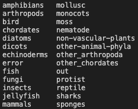

# sanger-tol/treeval: Usage

## :warning: Please read this documentation on the sanger-tol website: [https://pipelines.tol.sanger.ac.uk/treeval/](https://pipelines.tol.sanger.ac.uk/treeval/)

> _Documentation of pipeline parameters is generated automatically from the pipeline schema and can no longer be found in markdown files._

## Introduction

The TreeVal pipeline has a few requirements before being able to run:

- The gene_alignment_data and synteny data much follow a particular directory structure

- HiC CRAM files much already be pre-indexed in the same location as the CRAM file, e.g., `samtools index {cram file}`. If this would be more helpful to the community as an automated process then please submit an issue.

- Finally, the yaml file which is described below in Full Samplesheet. This needs to contain all of the information related to the assembly for the pipeline to run.

### Prior to running TreeVal

:warning: Please ensure you read the following sections on Directory Strucutre (gene_alignment_data, synteny, scripts), HiC data prep and Pacbio data prep. Without these you may not be able to successfully run the TreeVal pipeline. If nothing is clear then leave an issue report.

#### Directory Structure

Working example found here, [EXAMPLE](genealignmentsynteny.md), this will cover setting up synteny and gene_alignment_data directories as well as downloading some example data.

These two sub-workflows, for now, need the use of the variables `classT`, `synteny_genome_path`, `data_dir` and `geneset`. These variables are found inside the yaml ( this is the file that will tell TreeVal what and where everything is ). Currently, we don't use `common_name`, e.g., `bee`, `wasp`, `moth`, e.t.c. However, we hope to make use of it in the future as our gene_alignment_data "database" grows.

First, you should set up a directory in our recommended structure:

```bash

treeval-resources
  │
  ├─ gene_alignment_data/
  │   └─ { classT }
  │         ├─ csv_data
  │         │       └─ { Name.Assession }-data.csv # Generated by our scripts
  │         └─ { Name } # Here and below is generated by our scripts
  │                 └─ { Name.Assession }
  │                             ├─ cdna
  │                             │   └─ { Chunked fasta files }
  │                             ├─ rna
  │                             │   └─ { Chunked fasta files }
  │                             ├─ cds
  │                             │   └─ { Chunked fasta files }
  │                             └─ pep
  │                                 └─ { Chunked fasta files }
  │
  ├─ gene_alignment_prep/
  │   ├─ scripts/             # We supply these in this repo
  │   ├─ raw_fasta/           # Storing your fasta downloaded from NCBI or Ensembl
  │   └─ treeval-datasets.tsv # Organism, common_name, clade, family, group, link_to_data, notes
  │
  ├─ synteny/
  │   └─ {classT}
  │
  ├─ treeval_yaml/ # Storage folder for you yaml files, it's useful to keep them
  │
  └─ treeval_stats/ # Storage for you treeval output stats file whether for upload to our repo

```

`classT` can be your own system of classification, as long as it is consistent. At Sanger we use the below, we advise you do too. Again, this value, that is entered into the yaml (the file we will use to tell TreeVal where everything is), is used to find gene_alignment_data as well as syntenic genomes.



##### Synteny

For synteny, below the `classT` variable you should store the full genomic fasta file of any high quality genome you want to be compared against.

For bird we recommend the Golden Emu and the Finch, which can be downloaded from NCBI. Rename, these files to something more human readable, and drop them into the `synteny/bird/` folder. Any TreeVal run you now perform where the `classT` is bird will run a syntenic alignment against all genomes in that folder. It would be best to keep this to around three. Again, this is something we could expand on with the `common_name` field if people want in the future, submit a feature request.

##### Gene_alignment_data

This is the hardest part of the system to set up.

In the `gene_alignment_prep/raw_data` folder, download your gene sets from ncbi or ensembl (or your chosen geneset supplier of choice).

Currently, my scripts rely on the names of each file at this point being `{Organism}-{Accession}.{datatype}.fasta` so some examples would be:

```bash
ThalassiosiraPseudonana-ASM14940v2.cdna.fasta
ThalassiosiraPseudonana-ASM14940v2.cds.fasta
ThalassiosiraPseudonana-ASM14940v2.pep.fasta
ThalassiosiraPseudonana-ASM14940v2.rna.fasta
```

So ideally you want all four of the above datatypes, however, if they simply do not exist that is fine. The pipeline will only run on what is given to it. We have a number of insect gene sets which only exist as cDNA.

Now, you should have a raw folder with a number of folders (I advise doing this per `classT` otherwise you will get lost in a sea of latin names). And at this point we run our scripts.

The first is very aptly named, `gene_alignment_prep.py`. This script takes the input file and splits it into chunks inside a directory structure, using our example above it will produce:

```bash
ThalassiosiraPseudonana/
└── ThalassiosiraPseudonana.ASM14940v2
    ├── cdna
    │   └── ThalassiosiraPseudonana10cdna.MOD.fa
    ├── cds
    │   └── ThalassiosiraPseudonana1000cds.MOD.fa
    ├── pep
    │   └── ThalassiosiraPseudonana10pep.MOD.fa
    └── rna
        ├── ThalassiosiraPseudonana10009rna.MOD.fa
        ├── ThalassiosiraPseudonana1000rna.MOD.fa
        ├── ThalassiosiraPseudonana2001rna.MOD.fa
        ├── ThalassiosiraPseudonana3002rna.MOD.fa
        ├── ThalassiosiraPseudonana4003rna.MOD.fa
        ├── ThalassiosiraPseudonana5004rna.MOD.fa
        ├── ThalassiosiraPseudonana6005rna.MOD.fa
        ├── ThalassiosiraPseudonana7006rna.MOD.fa
        ├── ThalassiosiraPseudonana8007rna.MOD.fa
        └── ThalassiosiraPseudonana9008rna.MOD.fa
```

You can then move this folder into your location of choice, which should be `gene_alignment_data/{classT}`. And then run a second script which will generate the `{classT}/csv_data/ThalassiosiraPseudonana.ASM14940v2-data.csv`. The `ThalassiosiraPseudonana.ASM14940v2` chunk is what you will need to include in the `geneset` part of the yaml.

##### The Scripts for Gene_alignment

As i've noted above, there are two scripts. They both have a `-h` flag, which I hope will help. Scripts are currently stored in the `treeval/bin/treeval-dataprep/` and use the standard python libraries, just point it towards python3.

###### GA_data_prep

The first is `GA_data_prep.py` which we can run by using the following command:

`python3 GA_data_prep.py {FASTA} {ncbi|ens} {chunk size}`

An example is:

`python3 GA_data_prep.py ThalassiosiraPseudonana-ASM14940v2.rna.fasta ncbi 10`

However, I tend to "automate" it by using:

```bash
for i in *.fasta.gz; do
gunzip $i;
python3 GA_data_prep.py ${i/.gz} ncbi 10;
done
```

Data downloaded from ncbi or ensembl is in a gzipped format. So the above bash gunzips and then runs our chunking script.

This tells the script that the data comes from ncbi (as they have a slighlty difference header format to ensembl) and to chunk the cdna and pep in 10 sequences per file. rna and cds are always chunked in 1000 sequences per file. Leaving this field blank should default pep and cdna chunking to 100 sequences per file.

The script generates the directory format as shown in the `ThalassiosiraPseudonana/` example above. This folder is then moved to the gene_alignment_data directory before you run the next script.

It is worth checking whether or not any of the output files are larger than ~200mb, larger than this and you will start seeing some significant slow downs in execution time.

###### GA_csv_gen

The second is `GA_csv_gen.py` which is run by:
`python3 GA_csv_gen.py /path/to/gene_alignment_data/` This path should be the top level directory, e.g., the `treeval-resources/gene_alignment_data/` directory mentioned in the recommended directory structure above.

This will print out quite a bit of information that looks like this:

```bash
============> CorvusMon1.bCorMon1 -- bird
Generating CSV for:     CorvusMon1.bCorMon1
Save Path:              /gene_alignment_data/bird/csv_data/CorvusMon1.bCorMon1-data.csv
============> CorvusMoneduloides.bCorMon1 -- bird
Generating CSV for:     CorvusMoneduloides.bCorMon1
Save Path:              /gene_alignment_data/bird/csv_data/CorvusMoneduloides.bCorMon1-data.csv
============> Gallus_gallus.UW_022020 -- bird
Generating CSV for:     Gallus_gallus.UW_022020
Save Path:              /gene_alignment_data/bird/csv_data/Gallus_gallus.UW_022020-data.csv
============> Gallus_gallus.GRCg6a -- bird
Generating CSV for:     Gallus_gallus.GRCg6a
Save Path:              /gene_alignment_data/bird/csv_data/Gallus_gallus.GRCg6a-data.csv
============> GallusGallus.GRCg7b -- bird
Generating CSV for:     GallusGallus.GRCg7b
Save Path:              /gene_alignment_data/bird/csv_data/GallusGallus.GRCg7b-data.csv
```

So what is happening is that it is walking the directory, identifying each unique {organism.Accession} and generating a csv summarising the data found in those directories into a csv with the following information, this looks like:

```bash
(base) dp24@/scripts$ head -n 5 /gene_alignment_data/bird/csv_data/Gallus_gallus.GRCg6a-data.csv
org,type,data_file
Gallus_gallus.GRCg6a,cds,/gene_alignment_data/bird/Gallus_gallus/Gallus_gallus.GRCg6a/cds/Gallus_gallus9002cds.MOD.fa
Gallus_gallus.GRCg6a,cds,/gene_alignment_data/bird/Gallus_gallus/Gallus_gallus.GRCg6a/cds/Gallus_gallus28453cds.MOD.fa
Gallus_gallus.GRCg6a,cds,/gene_alignment_data/bird/Gallus_gallus/Gallus_gallus.GRCg6a/cds/Gallus_gallus18005cds.MOD.fa
Gallus_gallus.GRCg6a,cds,/gene_alignment_data/bird/Gallus_gallus/Gallus_gallus.GRCg6a/cds/Gallus_gallus6001cds.MOD.fa
```

This is all useful for the pipeline which generates job ids based on the org column, groups files by org and type columns and then pulls data from the data_file.

#### HiC data Preparation

Illumina HiC read files should be presented in an unmapped CRAM format, each must be accompanied by an index file (.crai) generated by samtools index. If your unmapped HiC reads are in FASTQ format, you should first convert them to CRAM format by using samtools import methods. Examples are below:

##### Conversion of FASTQ to CRAM

```bash
samtools import -@8 -r ID:{prefix} -r CN:{hic-kit} -r PU:{prefix} -r SM:{sample_name} {prefix}_R1.fastq.gz {prefix}_R2.fastq.gz -o {prefix}.cram
```

##### Indexing of CRAM

```bash
samtools index {prefix}.cram
```

#### PacBio Data Preparation

Find information on this here: [PacBio Data Prep](pacbio.md)

## Full samplesheet

The samplesheet for this pipeline is as shown below. This yaml is parsed by the pipeline and converted into the relevant channels.

- `assembly`
  - `sample_id`: ToLID of the sample.
  - `latin_name`: Latin identification of species
  - `classT`: Clade name (as used to group synteny sequences and to complete alignment/data_dir).
  - `TicketType`:
- `reference_file`: Sample .fa file
- `assem_reads`
  - `pacbio`: path to folder containing fasta.gz files.
  - `hic`: path to folder containing cram files
  - `supplementary`: #Will be required in future development.
- `alignment`
  - `data_dir`: Gene alignment data path
  - `common_name`: # For future implementation (adding bee, wasp, ant etc)
  - `geneset`: a csv list of geneset data to be used
- `self_comp`
  - `motif_len`: Length of motif to be used in self complementary sequence finding
  - `mummer_chunk`: Size of chunks used by MUMMER module.
- `synteny`
  - `synteny_genome_path`: Path to syntenic genomes grouped by clade.
- `outdir`: Will be required in future development.
- `intron:`
  - `size`: base pair size of introns default is 50k
- `telomere`:
  - `teloseq`: Telomeric motif
- `busco`
  - `lineages_path`: path to folder above lineages folder
  - `lineage`: Example is nematode_odb10

### Note on using BUSCO

The pipeline requires the use of the BUSCO subworkflows.
Create the database directory and move into the directory:

```bash
DATE=2023_03
BUSCO=/path/to/databases/busco_${DATE}
mkdir -p $BUSCO
cd $BUSCO
```

Download BUSCO data and lineages to allow BUSCO to run in offline mode.

## Subworkflows

- YAML_INPUT
  - Reads the input yaml and generates parameters used by other workflows.
- GENERATE_GENOME
  - Builds genome description file of the reference genome.
- LONGREAD_COVERAGE
  - Produces read coverage based on pacbio long read fasta file.
- GAP_FINDER
  - Identifies contig gaps in the input genome.
- REPEAT_DENSITY
  - Reports the intensity of regional repeats within an input assembly.
- HIC_MAPPING
  - Aligns illumina HiC short reads to the input genome, generates mapping file in three format for visualisation: .pretext, .hic and .mcool
- TELO_FINDER
  - Find a user given motif in the input genome.
- GENE_ALIGNMENT
  - Aligns the peptide and nuclear data from assemblies of related species to the input genome.
- INSILICO_DIGEST
  - Generates a map of enzymatic digests using 3 Bionano enzymes.
- SELFCOMP
  - Identifies regions of self-complementary sequence.
- SYNTENY
  - Generates syntenic alignments between other high quality genomes.
- BUSCO_ANALYSIS
  - Uses BUSCO to identify ancestral elements. Also use to identify ancestral Lepidopteran genes (merian units).

```bash
wget -r -nH https://busco-data.ezlab.org/v5/data/
# the trailing slash after data is important. Otherwise wget doesn't get the subdirectories

# tar gunzip all folders that have been stored as tar.gz, in the same parent directories as where they were stored:
find v5/data -name "*.tar.gz" | while read -r TAR; do tar -C `dirname $TAR` -xzf $TAR; done
```

If you have [GNU parallel](https://www.gnu.org/software/parallel/) installed, you can also use the command below which will run faster as it will run the decompression commands in parallel:

````bash
find v5/data -name "*.tar.gz" | parallel "cd {//}; tar -xzf {/}"

## Running the pipeline

The typical command for running the pipeline is as follows:

```console
nextflow run sanger-tol/treeval --input assets/treeval.yaml --outdir <OUTDIR> -profile singularity, sanger
````

With the `treeval.yaml` containing:

You will need to create a .yaml with information about the sample you would like to analyse before running the pipeline. Use this parameter to specify its location. It has to follow the structure shown in the full samplesheet shown above.

### Updating the pipeline

When you run the above command, Nextflow automatically pulls the pipeline code from GitHub and stores it as a cached version. When running the pipeline after this, it will always use the cached version if available - even if the pipeline has been updated since. To make sure that you're running the latest version of the pipeline, make sure that you regularly update the cached version of the pipeline:

```console
nextflow pull sanger-tol/treeval
```

### Reproducibility

It is a good idea to specify a pipeline version when running the pipeline on your data. This ensures that a specific version of the pipeline code and software are used when you run your pipeline. If you keep using the same tag, you'll be running the same version of the pipeline, even if there have been changes to the code since.

First, go to the [sanger-tol/treeval releases page](https://github.com/sanger-tol/treeval/releases) and find the latest version number - numeric only (eg. `1.3.1`). Then specify this when running the pipeline with `-r` (one hyphen) - eg. `-r 1.3.1`.

This version number will be logged in reports when you run the pipeline, so that you'll know what you used when you look back in the future.

## Core Nextflow arguments

> **NB:** These options are part of Nextflow and use a _single_ hyphen (pipeline parameters use a double-hyphen).

### `-profile`

Use this parameter to choose a configuration profile. Profiles can give configuration presets for different compute environments.

Several generic profiles are bundled with the pipeline which instruct the pipeline to use software packaged using different methods (Docker, Singularity, Podman, Shifter, Charliecloud, Conda) - see below. When using Biocontainers, most of these software packaging methods pull Docker containers from quay.io e.g [FastQC](https://quay.io/repository/biocontainers/fastqc) except for Singularity which directly downloads Singularity images via https hosted by the [Galaxy project](https://depot.galaxyproject.org/singularity/) and Conda which downloads and installs software locally from [Bioconda](https://bioconda.github.io/).

> We highly recommend the use of Docker or Singularity containers for full pipeline reproducibility, however when this is not possible, Conda is also supported.

The pipeline also dynamically loads configurations from [https://github.com/nf-core/configs](https://github.com/nf-core/configs) when it runs, making multiple config profiles for various institutional clusters available at run time. For more information and to see if your system is available in these configs please see the [nf-core/configs documentation](https://github.com/nf-core/configs#documentation).

Note that multiple profiles can be loaded, for example: `-profile test,docker` - the order of arguments is important!
They are loaded in sequence, so later profiles can overwrite earlier profiles.

If `-profile` is not specified, the pipeline will run locally and expect all software to be installed and available on the `PATH`. This is _not_ recommended.

- `docker`
  - A generic configuration profile to be used with [Docker](https://docker.com/)
- `singularity`
  - A generic configuration profile to be used with [Singularity](https://sylabs.io/docs/)
- `podman`
  - A generic configuration profile to be used with [Podman](https://podman.io/)
- `shifter`
  - A generic configuration profile to be used with [Shifter](https://nersc.gitlab.io/development/shifter/how-to-use/)
- `charliecloud`
  - A generic configuration profile to be used with [Charliecloud](https://hpc.github.io/charliecloud/)
- `conda`
  - A generic configuration profile to be used with [Conda](https://conda.io/docs/). Please only use Conda as a last resort i.e. when it's not possible to run the pipeline with Docker, Singularity, Podman, Shifter or Charliecloud.
- `test`
  - A profile with a complete configuration for automated testing
  - Includes links to test data so needs no other parameters

### `-resume`

Specify this when restarting a pipeline. Nextflow will use cached results from any pipeline steps where the inputs are the same, continuing from where it got to previously. For input to be considered the same, not only the names must be identical but the files' contents as well. For more info about this parameter, see [this blog post](https://www.nextflow.io/blog/2019/demystifying-nextflow-resume.html).

You can also supply a run name to resume a specific run: `-resume [run-name]`. Use the `nextflow log` command to show previous run names.

### `-c`

Specify the path to a specific config file (this is a core Nextflow command). See the [nf-core website documentation](https://nf-co.re/usage/configuration) for more information.

## Custom configuration

### Resource requests

Whilst the default requirements set within the pipeline will hopefully work for most people and with most input data, you may find that you want to customise the compute resources that the pipeline requests. Each step in the pipeline has a default set of requirements for number of CPUs, memory and time. For most of the steps in the pipeline, if the job exits with any of the error codes specified [here](https://github.com/sanger-tol/blobtoolkit/blob/56906ffb5737e4b985797bb5fb4b9c94cfe69600/conf/base.config#L18) it will automatically be resubmitted with higher requests (2 x original, then 3 x original). If it still fails after the third attempt then the pipeline execution is stopped.

To change the resource requests, please see the [max resources](https://nf-co.re/docs/usage/configuration#max-resources) and [tuning workflow resources](https://nf-co.re/docs/usage/configuration#tuning-workflow-resources) section of the nf-core website.

### nf-core/configs

In most cases, you will only need to create a custom config as a one-off but if you and others within your organisation are likely to be running nf-core pipelines regularly and need to use the same settings regularly it may be a good idea to request that your custom config file is uploaded to the `nf-core/configs` git repository. Before you do this please can you test that the config file works with your pipeline of choice using the `-c` parameter. You can then create a pull request to the `nf-core/configs` repository with the addition of your config file, associated documentation file (see examples in [`nf-core/configs/docs`](https://github.com/nf-core/configs/tree/master/docs)), and amending [`nfcore_custom.config`](https://github.com/nf-core/configs/blob/master/nfcore_custom.config) to include your custom profile.

See the main [Nextflow documentation](https://www.nextflow.io/docs/latest/config.html) for more information about creating your own configuration files.

If you have any questions or issues please send us a message on [Slack](https://nf-co.re/join/slack) on the [`#configs` channel](https://nfcore.slack.com/channels/configs).

## Running in the background

Nextflow handles job submissions and supervises the running jobs. The Nextflow process must run until the pipeline is finished.

The Nextflow `-bg` flag launches Nextflow in the background, detached from your terminal so that the workflow does not stop if you log out of your session. The logs are saved to a file.

Alternatively, you can use `screen` / `tmux` or similar tool to create a detached session which you can log back into at a later time.
Some HPC setups also allow you to run nextflow within a cluster job submitted your job scheduler (from where it submits more jobs).

## Nextflow memory requirements

In some cases, the Nextflow Java virtual machines can start to request a large amount of memory.
We recommend adding the following line to your environment to limit this (typically in `~/.bashrc` or `~./bash_profile`):

```console
NXF_OPTS='-Xms1g -Xmx4g'
```
