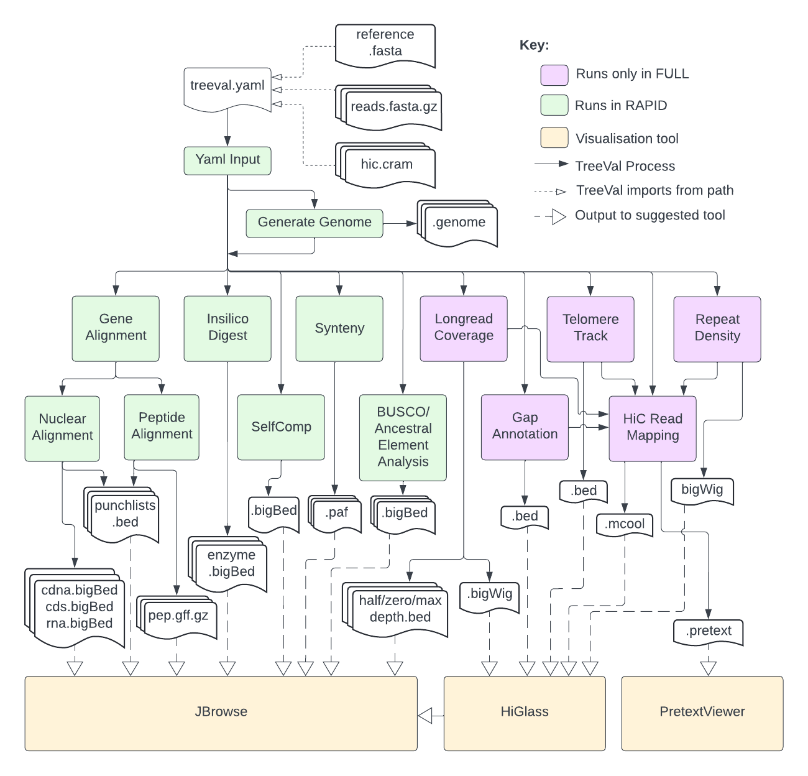

# Summary

The Tree of Life Project aims to sequence the entirety of complex life in Britain and Northern Ireland, producing high-quality reference genome assemblies for an estimated 70,000 species in this region. Manual curation incorporates domain expertise to refine the output genome assemblies from the pipeline to a higher level of accuracy. We have developed a set of standardized analysis metrics that serve as guidelines for examining and evaluating genomes requiring curation. Additionally, we aim to automate the analysis process to achieve high-throughput efficiency. As a key step towards automation, we present the TreeVal data processing pipeline (v1.1.0), a bipartite project designed to generate and display a diverse array of data necessary for the manual curation of genomic assemblies into reference-quality assemblies. This is facilitated through tools such as JBrowse2 and HiGlass. The pipeline is implemented in Nextflow, with dependencies distributed via conda, Docker and Singularity. The code is publicly available on GitHub at the following URL: https://github.com/sanger-tol/treeval/releases/tag/v1.1.0.

# Statement of need

The manual curation of genome assemblies addresses the problem of misassemblies generated by automated assembly pipelines and aims to scale the genome to the chromosome level, thereby creating a high-quality reference genome. This process necessitates the provision of specific metrics in advance, as outlined in the TreeVal of Life project. Key components of the analysis include Hi-C mapping using Illumina short reads, assessment of assembly read depth coverage, analysis of repeat element density, identification of sequence gaps, and telomere annotation. Advanced genome structure analysis typically involves additional evaluations, such as self-comparative analysis, transcriptome and proteome alignments, Benchmarking Universal Single-Copy Orthologs (BUSCO) analysis, and in silico digestion with Bionano restriction enzymes. These data can be visualised using tools like HiGlass and JBrowse, providing domain experts with immediate visual feedback to evaluate genome assemblies. Historically, we employed a similar set of analyses coupled with Ensembl annotations, visualised through the gEVAL browser. However, the gEVAL genome browser suffered from a lack of updates and was heavily reliant on a database-driven infrastructure, which posed significant maintenance challenges. As a result, we transitioned to more flexible, flat-file-based browsers such as JBrowse and HiGlass, which facilitate improved data management. Within the TreeVal project, we have operationalized these analyses through the TreeVal pipeline, incorporating the aforementioned data processing methods. This pipeline has already contributed to the completion of approximately 2,000 reference genome assemblies. The TreeVal pipeline is now poised for broader distribution, enabling support for higher-throughput manual genome curation efforts.

# Materials and Methods
## Features

## Workflow
Figure 1 \autoref{workflow_overview} depicts the workflow:

## Configuration file

## Installation and Execution

## Output and Error Handling

# Conclusions and Discussions

# Figures

# Acknowledgements

# References